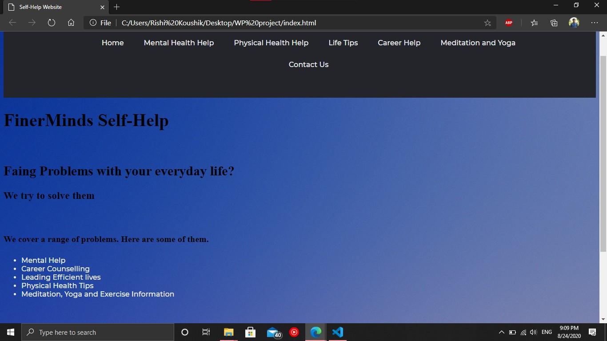
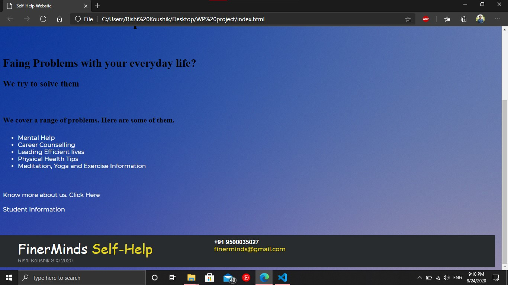
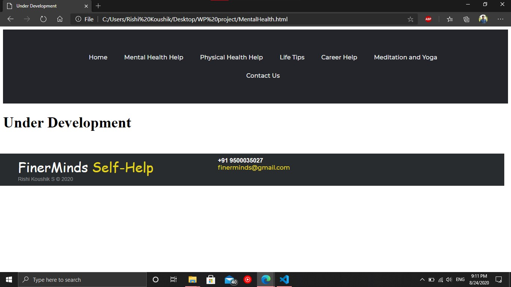
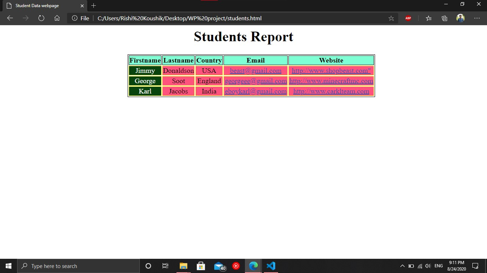
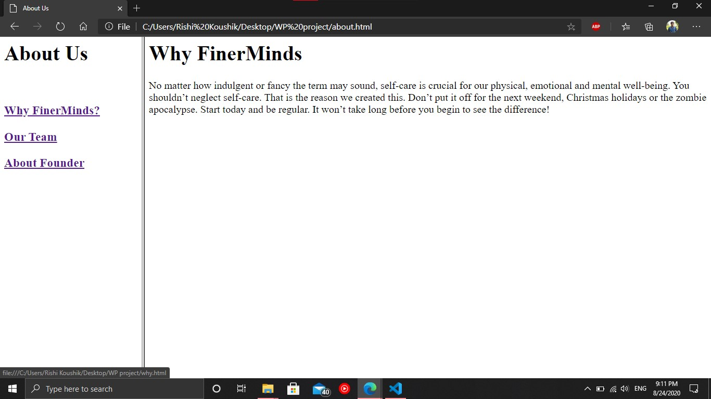
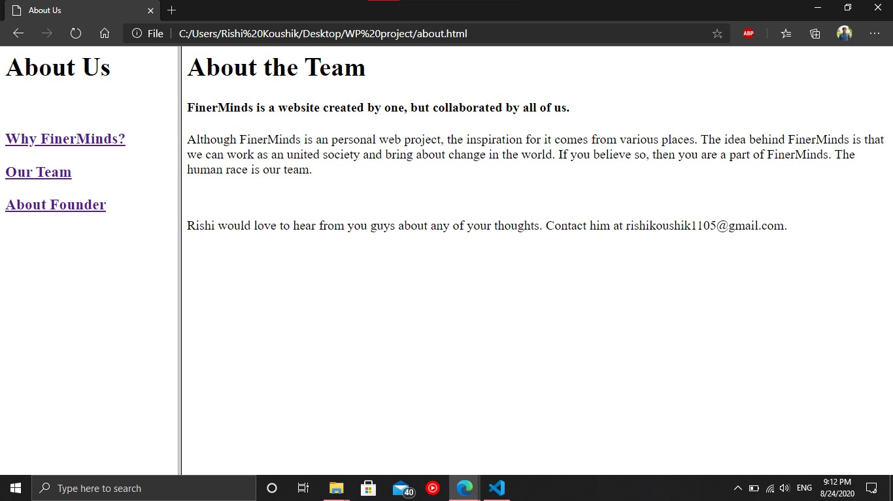
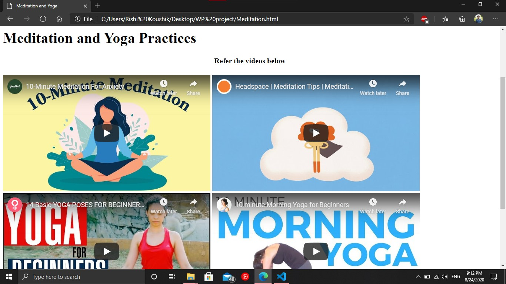

# SelfHelp-Website
Built using HTML, CSS and JS. Objective of website is to create a self help portal where people could access resources related to all sorts of help that they need.This website is still under development. 
## Technologies Used
```bash
HTML
CSS
Javascript
```
## Code
Check out the src section for all the source code files.

## Run Locally

- git clone https://github.com/rishikoushik1105/SelfHelp-Website.git
- Open index.html file with any Browser and you are good to go

Let me know if you have any questions. [Email Rishi Koushik S](mailto:rishikoushik1105@gmail.com)

## Home Screen with header


## Home Screen with Footer


## Header and Footer in different webpage


## Student Information Table


## Frameset


## Frameset continued


## Embeded Files


## Contributing
Pull requests are welcome. For major changes, please open an issue first to discuss what you would like to change.
Please make sure to update tests as appropriate.

## License
[Rishi Koushik S](https://www.linkedin.com/in/rishi-koushik-s-5468b119a/)
